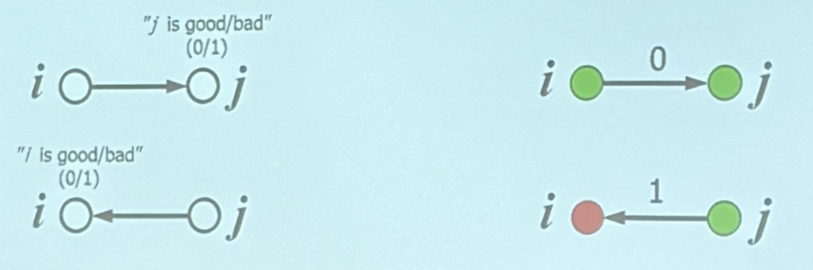
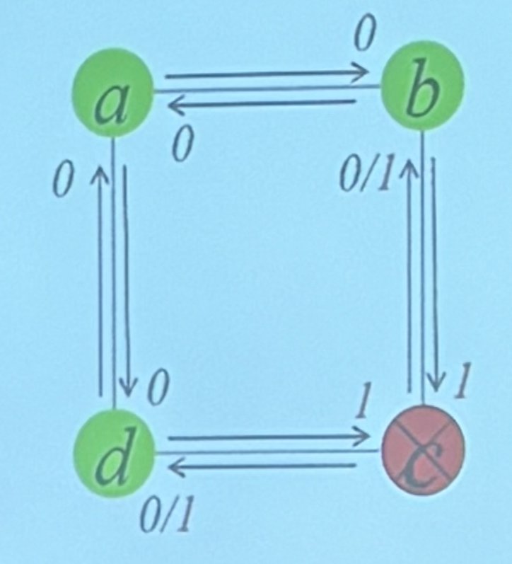

### 日期:2026/09/15
### 報告主題:網路診斷與容錯
### 講師:王大進
---
### interconnection networks
有 node 就會有 faults node ，
最重要先找壞點(faults node)
### 方法:互相測試

由 i 節點測試 j 節點，正常為 0、故障為 1  
由 j 節點測試 i 節點，正常為 0、故障為 1  由 j 節點測試 i 節點，正常為 0、故障為 1
只有正常節點去測試，結果會固定  
故障節點去測試，結果為隨機  

| a->b | a->d | b->a | b->c | c->b | c->d | d->a | d->c |
|---|---|---|---|---|---|---|---|
| 0 | 0 | 0 | 1 | 0 | 0 | 0 | 1 |
| 0 | 0 | 0 | 1 | 0 | 1 | 0 | 1 |
| 0 | 0 | 0 | 1 | 1 | 0 | 0 | 1 |
| 0 | 0 | 0 | 1 | 1 | 1 | 0 | 1 |
### PMC Model:Preparata-Metze-Chien
